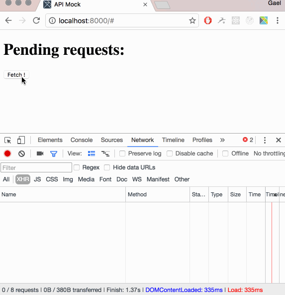

# mockingbird
Interactive API Mock for webapp development

## WORK IN PROGRESS: here is what it can currently do:

The "Fetch!" button simulates your app: it sends regular HTTP requests. These requests are intercepted by a service worker and the list of pending requests is displayed. On each request, I can either send a mock response (with hard coded body) or just pass it through

## Background
I just wanted to learn about Elm and Service Workers. Also I spend a lot of time trying to reproduce
obscure edge cases that can happen when consuming an HTTP API, and I figured out being able to
interactively build an API mock could be fun. So I started building this. No idea if it will end up
anywhere ¯\_(ツ)_/¯
